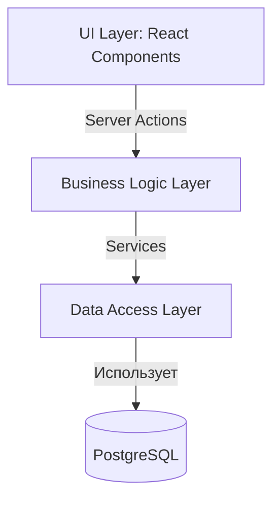

# Введение в проект "БыстраяКорзина"

Этот документ — точка входа для нового разработчика. Он дает краткий, но исчерпывающий обзор проекта, его архитектуры и ключевых принципов.

---

### 1. Концепция и технологический стек

"БыстраяКорзина" — это современное e-commerce приложение для доставки продуктов.

**Ключевые принципы:**
- **Server-First подход**: Максимум логики выполняется на сервере для высокой производительности.
- **Модульность**: Четкое разделение на слои для простоты поддержки и масштабирования.
- **Готовность к AI**: Архитектура спроектирована для легкой интеграции с генеративными моделями.

**Технологический стек:**
- **Фреймворк**: Next.js (App Router)
- **Язык**: TypeScript
- **UI**: React, ShadCN UI, Tailwind CSS
- **База данных**: PostgreSQL (подключается через Cloud SQL)
- **Хранилище**: Google Cloud Storage
- **AI**: Google Genkit

---

### 2. Архитектура

Проект следует классической **трехслойной архитектуре**.

1.  **Слой Представления (UI)**
    -   **Где**: `src/app/**`, `src/components/**`
    -   **Описание**: React-компоненты (преимущественно серверные), которые отвечают только за отображение. Они не содержат бизнес-логики.

2.  **Слой Действий и Сервисов (Бизнес-логика)**
    -   **Где**: `src/app/actions/**`, `src/lib/services/**`
    -   **Описание**: `Server Actions` служат точкой входа для UI. Они валидируют данные и вызывают сервисы. `Services` инкапсулируют всю бизнес-логику и являются единственным местом с прямыми запросами к базе данных.

3.  **Слой Доступа к Данным (Data Access)**
    -   **Где**: `src/lib/db.ts`, `src/lib/s3-client.ts`
    -   **Описание**: Низкоуровневые модули, которые управляют подключением к PostgreSQL и Google Cloud Storage.



---

### 3. Как запустить локально

Проект спроектирован для работы в **Firebase Studio**. Для корректной работы с данными вне продакшн-окружения реализован специальный механизм.

**Ключевой принцип:**
Проект использует **централизованный helper** для определения окружения. Никогда не используйте `process.env` напрямую!

```typescript
// src/lib/env.ts
export const isLocal = () => !process.env.K_SERVICE;

// В сервисах (например, products.service.ts)
import { isLocal } from '@/lib/env';

export async function getProducts() {
    if (isLocal()) {
        console.warn("Running in local/studio environment. Returning mock products.");
        return [mockProduct]; // Возвращаем тестовые данные
    }
    // ... логика для реального запроса к БД
}
```

---

### 4. Работа с AI-ассистентом

Проект активно использует AI для генерации кода. **Обязательные правила:**

- Код генерируется только после явной команды.
- Каждый PR с AI-кодом помечается `ai-generated: true`.
- Обязательный human review перед слиянием.
- Тесты пишутся вместе с кодом.
- Feature flags для новой функциональности.

Подробнее: `docs/conventions.md`.

---

### 5. Частые проблемы

- **Ошибки TypeScript при импортах:**
    - Проверьте `ESLint rules` для разделения клиентского и серверного кода.
    - Серверные модули нельзя импортировать в клиентские компоненты.
- **Mock-данные не обновляются:**
    - Убедитесь, что используете helper `isLocal()`.
    - Проверьте актуальность `src/lib/mock-data.ts`.
- **AI-сгенерированный код не мержится:**
    - Вы пометили PR как `ai-generated: true`?
    - Получили подтверждение от старшего разработчика (`human approve`)?
    - Тесты написаны и проходят?

---

### 6. Важные файлы для ознакомления

- **Обязательно прочитать:**
    - `docs/vision.md`: Главное техническое и продуктовое видение.
    - `docs/conventions.md`: Строгие правила разработки и AI-генерации.
    - `docs/tasklist.md`: Актуальный план работ.
    - `docs/workflow.md`: Описание рабочего процесса.
- **Ключевые модули:**
    - `src/lib/env.ts`: Централизованный helper окружения.
    - `src/lib/mock-data.ts`: Mock-данные для разработки.
    - `src/lib/types.ts`: Основные типы TypeScript.
- **Конфигурация:**
    - `apphosting.yaml`: Конфигурация деплоймента для Firebase App Hosting.
    - `.eslintrc.json`: Правила, включая ограничения на импорты.
